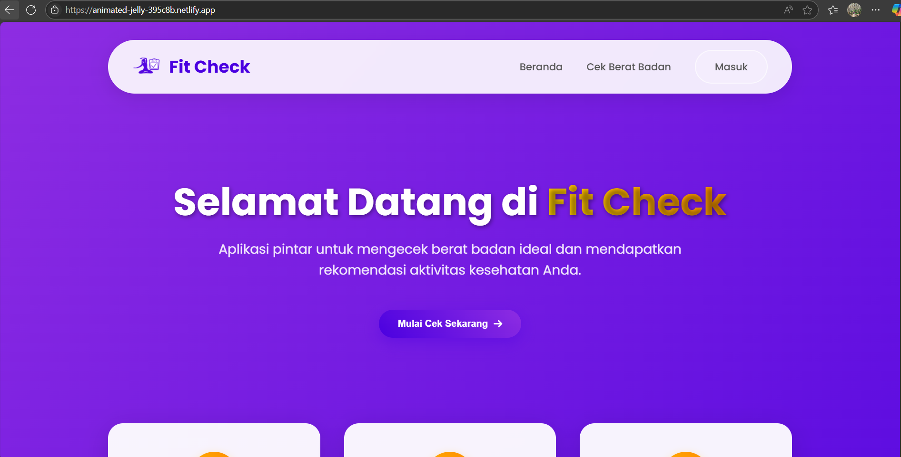
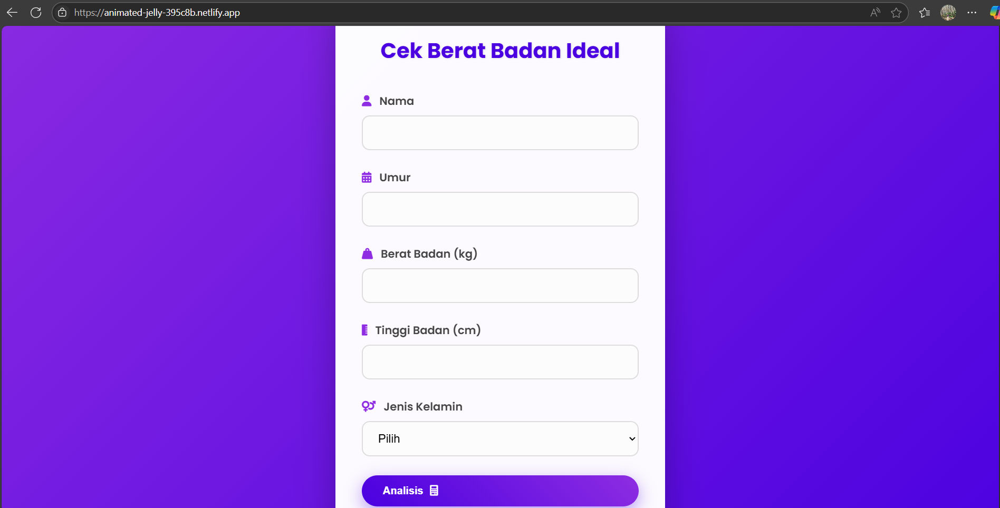
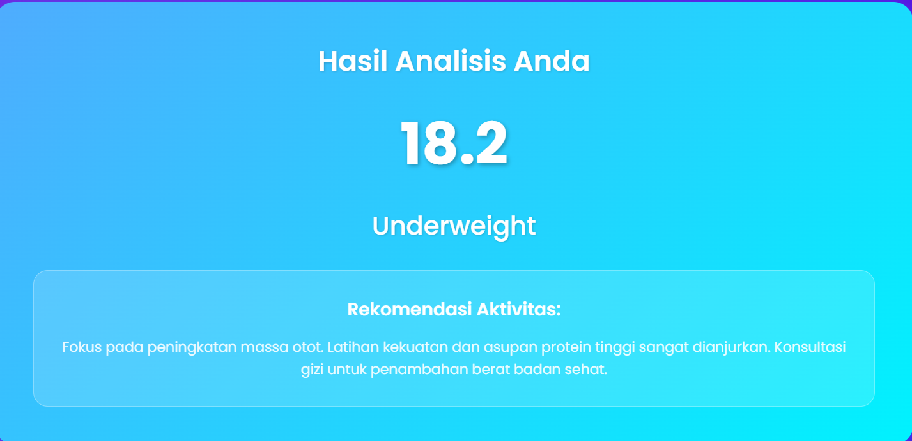

# 📌 Capstone Project – FitCheck: Aplikasi Web Pemeriksa Berat Badan Ideal

FitCheck adalah aplikasi web interaktif yang membantu pengguna memeriksa status berat badan ideal (BMI) dan memberikan rekomendasi aktivitas berdasarkan input seperti berat badan, tinggi badan, usia, dan jenis kelamin. Proyek ini merupakan bagian dari Projek Akhir (Capstone Project) dalam program Coding Camp powered by DBS Foundation.

# 👥 Tim Pengembang - CC25-CF037

Proyek ini dibangun melalui kolaborasi lintas disiplin antara alur belajar Machine Learning dan Front-end & Back-end Development.

|       Nama Anggota       |    Alur Belajar      |       University        |
| ------------------------ | -------------------- | ----------------------- |
| Nadila Agustiani Farhan  | Machine Learning     | STMIK Mardira Indonesia |
| Tisna Rizqiana           | Front-end & Back-end | STMIK Mardira Indonesia |
| Risma Rahmatul Ummah     | Front-end & Back-end | STMIK Mardira Indonesia |
| Siti Nurjanah            | Machine Learning     | STMIK Mardira Indonesia |
| Nayma Alaydia            | Machine Learning     | Universitas Syiah Kuala |

# 🧠 Tentang Aplikasi
FitCheck hadir untuk menjawab kebutuhan masyarakat akan informasi status berat badan yang akurat dan ilmiah, bukan berdasarkan persepsi subjektif atau standar kecantikan semata.
 

### Deployment Aplikasi
Pada tahap deployment, kami menggunakan Netlify untuk hosting aplikasi fitcheck sehingga dapat diakses dengan baik
**Link Aplikasi** : [Kunjungi FitCheck](https://animated-jelly-395c8b.netlify.app/)

## Aplikasi ini memungkinkan pengguna untuk:
- Menghitung Indeks Massa Tubuh (BMI)
- Mendapatkan rekomendasi aktivitas fisik berdasarkan hasil klasifikasi BMI
- Membaca artikel gaya hidup sehat
- Melihat riwayat status dan aktivitas melalui fitur profil pengguna
  
Projek ini dikembangkan selama 1 bulan, yang mana memadukan model Machine Learning multi-output dan pengembangan aplikasi web secara terintegrasi. Kami menekankan kolaborasi tim yang efisien untuk memastikan akurasi, kecepatan, dan pengalaman pengguna yang optimal.

## 🛠️ Teknologi yang Digunakan
### ⚙️ Machine Learning
- Python: Bahasa utama pengembangan model
- TensorFlow & Keras: Membangun dan melatih model deep learning
- Scikit-learn: Preprocessing data & model ML klasik (Random Forest, SVM)
- Google Colab: Pelatihan model berbasis cloud (GPU)
- Pandas & NumPy: Manipulasi dan analisis data
- Matplotlib & Seaborn: Visualisasi data (opsional)

### 💻 Front-End
- IDE: Visual Studio Code
- React.js: Framework utama antarmuka pengguna
- Tailwind CSS: Styling fleksibel dan modern
- Vite: Module bundler cepat untuk development
- Postman: Pengujian API
- Browser: Chrome, Firefox untuk pengujian

### 🖥️ Back-End
- Node.js: Environment backend
- Hapi.js: Framework REST API modular & aman
- Storage: JSON file (dapat dikembangkan ke database relasional)
- API: RESTful API untuk komunikasi data & model ML
- Version Control: Git & GitHub untuk kolaborasi kode
- Database SQL : Untuk mengelola dan menyimpan data

## 🌟 Fitur Aplikasi
- Beranda – Informasi umum dan navigasi
- Cek Berat Badan – Hitung BMI dan tampilkan rekomendasi aktivitas
- Profil – Kelola data pengguna
- Riwayat Status – Lihat histori hasil pemeriksaan
- Artikel – Baca tips dan edukasi gaya hidup sehat

## 📬 Kontak
Untuk pertanyaan dan kolaborasi, silakan hubungi anggota tim melalui GitHub masing-masing atau melalui LinkedIn.
| Nama | LinkedIn |
| ---- | -------- |
| Nadila Agustiani Farhan |  |
| Tisna Rizqiana |  |
| Risma Rahmatul Ummah |  |
| Siti Nurjanah |  |
| Nayma Alaydia |  | 

